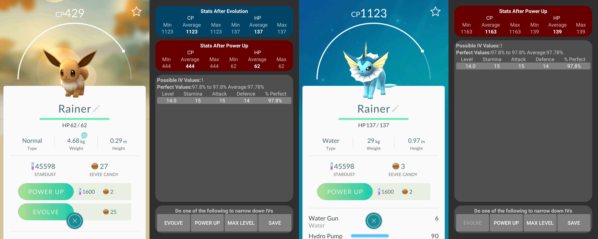

# PokemonGoCalc

[APK Download Link](https://raw.githubusercontent.com/McAJBen/PokemonGoCalc/master/PokemonGoCalcv0.6.2.apk)

An Android App for Pokemon Go that calculates IV values of Pokemon.

Uses IV stats to tell what your CP/HP will be after Evolving/Powering up.

Finding what level an Eevee will evolve into

Finding what level an Electrabuzz will power up to

